# 使用手册（未订正）

## 管理中心

### 角色的管理

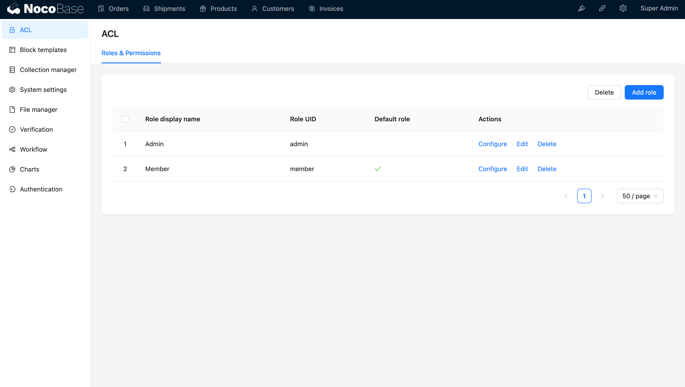

初始化安装的应用内置了两个角色，分别是 "Admin" 和 "Member"，它们具有不同的默认权限设置。

### 角色的增删改

角色标识（系统唯一标识），可以自定义默认角色，不可将系统默认角色删除

### 设置默认角色

这里的默认角色是指当新建的用户没有配角色时，默认用哪个角色

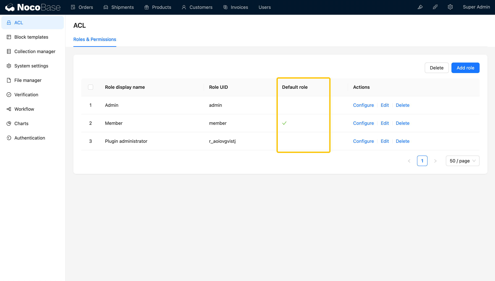

### 配置权限

#### 通用权限配置

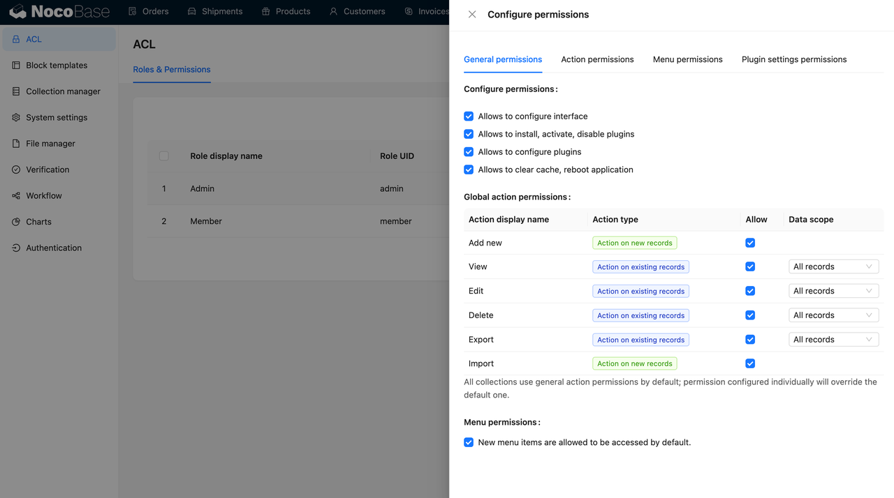

##### 配置权限

1. 允许配置界面：该权限控制是否允许用户配置界面。激活此权限后，出现 UI 配置按钮。"admin" 角色默认启用此权限。
2. 允许安装、激活、禁用插件：该权限控制是否允许用户启用或禁用插件。激活此权限后，用户可以访问插件管理器界面。"admin" 角色默认启用此权限。
3. 允许配置插件：该权限控制是否允许用户配置插件参数或管理插件后台数据。"admin" 角色默认启用此权限。
4. 允许清除缓存，重启应用：该权限控制的是用户的系统运维权限： 清空缓存和重启应用。激活后，相关操作按钮将出现在个人中心,默认不启用。
5. 新增菜单项默认允许访问：默认新建的菜单允许访问，默认开启

##### 全局操作权限

全局操作权限对全局生效（所有数据表）按照操作类型划分，支持根据数据范围维度配置：所有数据和自己的数据。前者允许对整个数据表执行操作，而后者限制仅能处理自己相关的数据。

#### 数据表操作权限

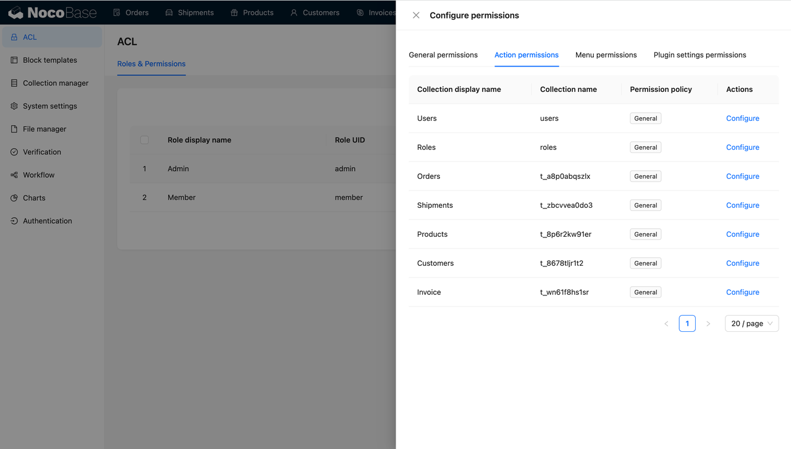

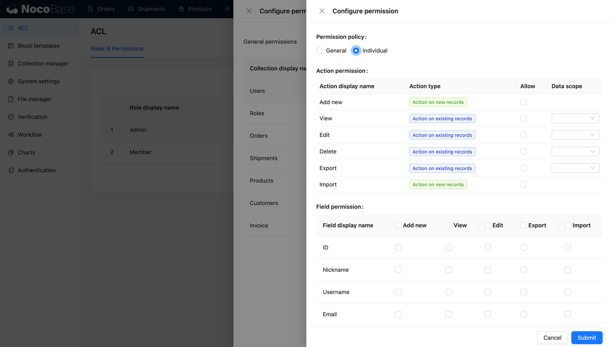

数据表操作权限进一步细化了全局操作权限，可以针对每个数据表的资源访问进行个别的权限配置。这些权限分为两个方面：

1. 操作权限：操作权限包括添加、查看、编辑、删除、导出和导入操作。这些权限根据数据范围的维度进行配置：

   - 所有数据：允许用户对数据表中的所有记录执行操作。
   - 自己的数据：限制用户仅对自己创建的数据记录执行操作。

2. 字段权限：字段权限允许对每个字段在不同操作中进行权限配置。例如，某些字段可以配置为只允许查看而不允许编辑。

#### 菜单访问权限

菜单访问权限以菜单为维度控制访问权限

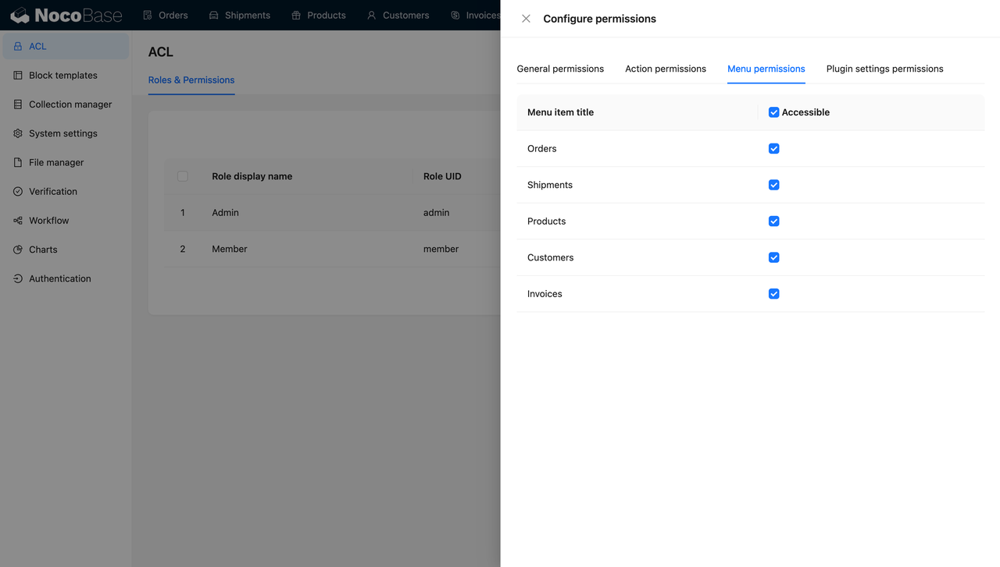

#### 插件配置权限

插件配置权限用于控制对特定插件参数的配置权限，当插件配置权限勾选后管理中心将出现对应的插件管理界面

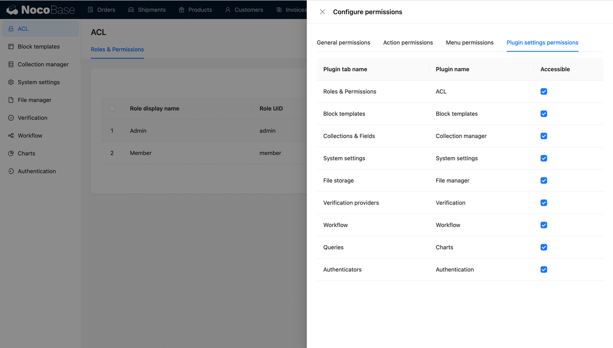

## 个人中心

### 角色切换

可以为一个用户分配多个角色，当用户拥有多个角色时，可在个人中心切换角色

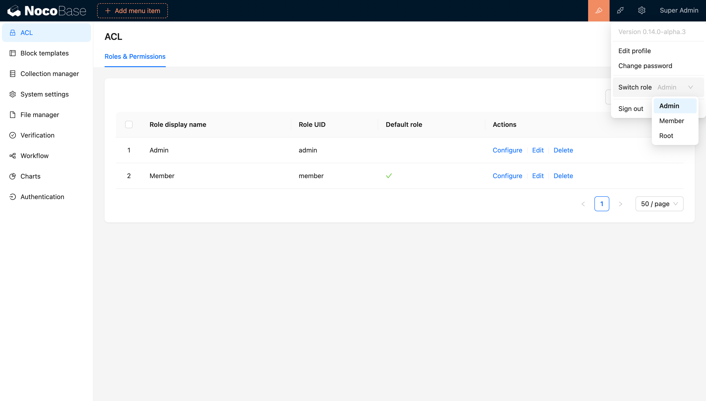

用户进入系统的的默认角色优先级为：上一次切换的角色（每次切换角色时会更新默认角色值）> 第一个角色（系统默认角色）

## 在 UI 中的应用

### 数据区块的权限

数据表数据区块是否可见由查看操作权限控制（单独配置的优先级高于全局）

如下图：全局权限下 admin 拥有所有权限，订单表配置单独权限（不可见）

全局权限配置如下：

订单表单独权限配置如下：

在 UI 上的表现为订单表的所有区块均不显示

完整配置流程如下

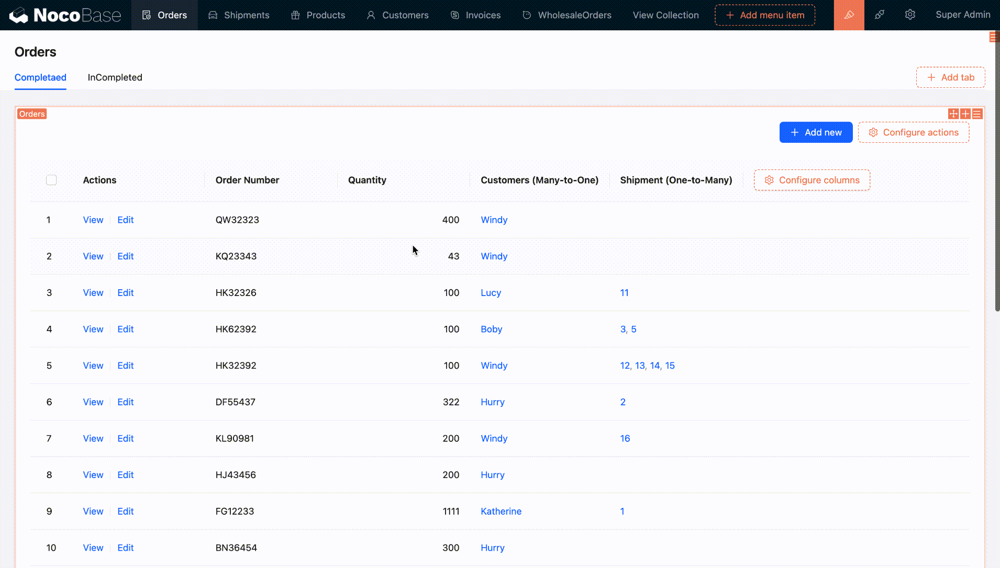

### 字段权限

查看: 控制字段字段级别是否可见，例如控制某个角色对订单表的某些字段可见

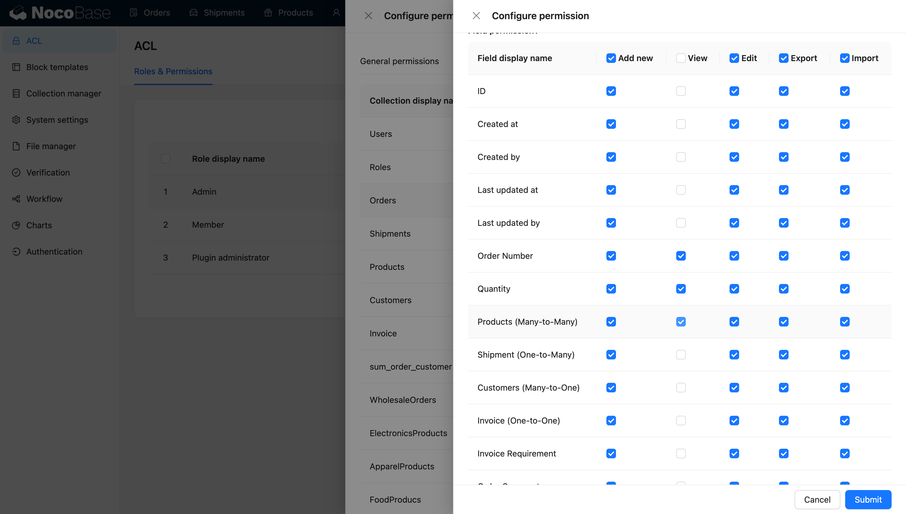

在 UI 上表现为订单表的区块中只显示有配置权限的字段，系统字段（Id,CreateAt ,Last updated at）即使不配置也有查看权限

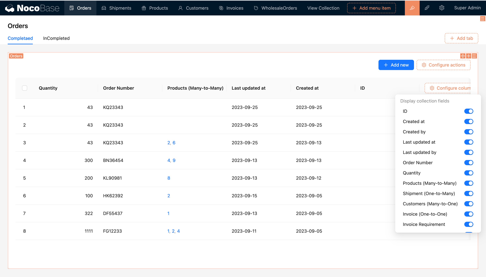

- 编辑:控制字段是否可以编辑保存(更新)

如图配置订单表字段的编辑权限（数量和关联的商品有编辑权限）

在 UI 上的表现为订单表区块的编辑操作表单区块只显示有编辑权限的字段

完整配置流程如下：

- 添加:控制字段是否可以添加（创建）

如图配置订单表字段的添加权限（订单编号、数量、商品、运单有添加权限)

在 UI 中表现为订单表区块的添加操作表单区块中只显示有添加权限的字段

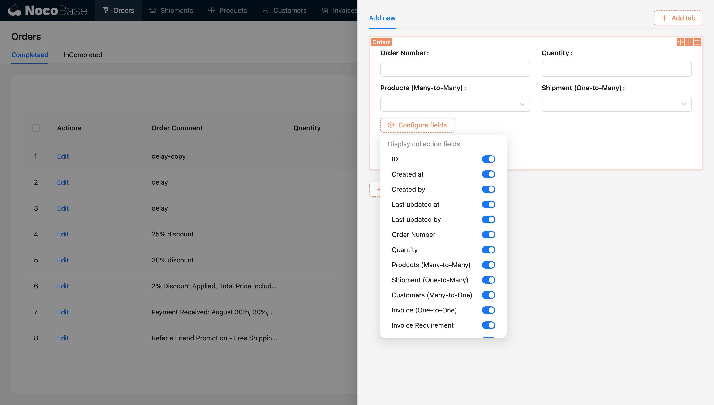

- 导出:控制字段是否可以导出
- 导入:控制字段是否支持导入

### 操作权限

单独配置的优先级最高，有单独配置按单独配置权限没有则走全局配置的权限

- 添加，控制区块中添加操作按钮是否显示

如图订单表单独配置操作权限，允许添加

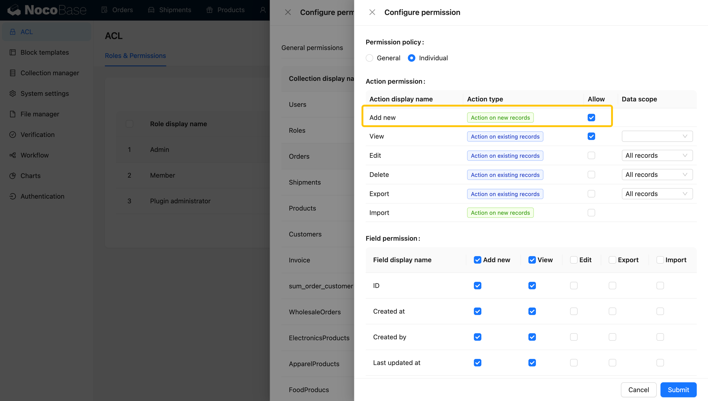

在 UI 中表现为订单表区块中操作区域中添加按钮显示

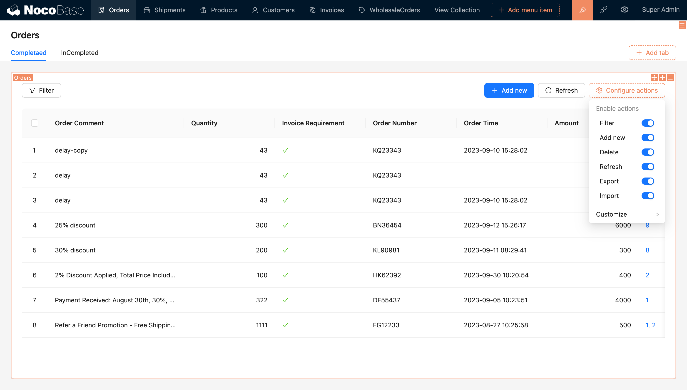

- 查看

控制数据区块是否显示

如图全局权限配置如下（没有查看权限）

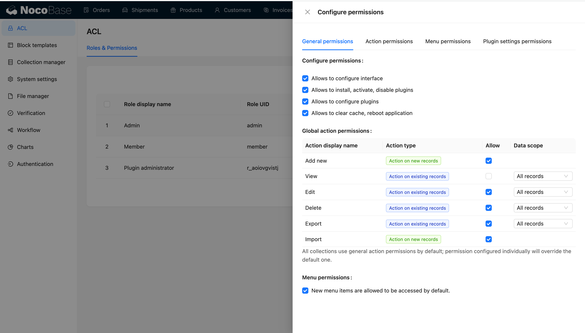

订单表单独配置权限如下

在 UI 中表现为：其他所有数据表的区块均不显示，订单表的区块显示。

完整示例配置流程如下

- 编辑

控制区块内的编辑操作按钮是否显示

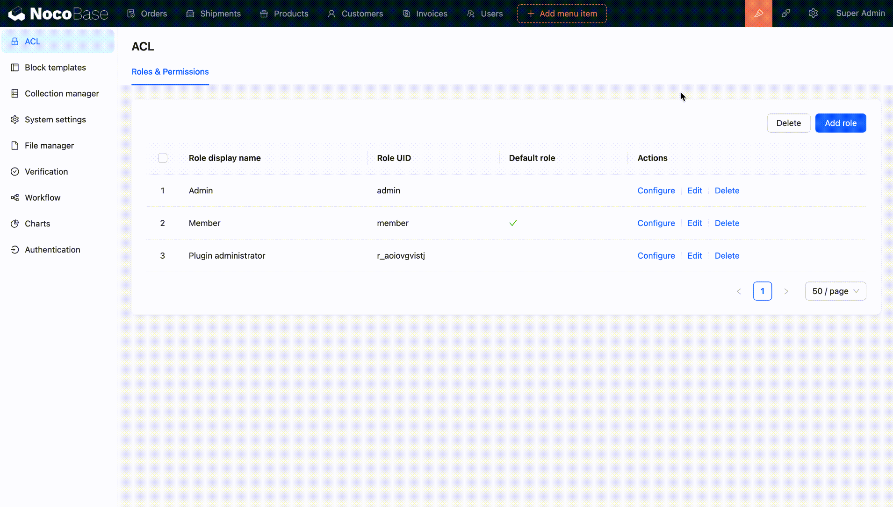

通过设置数据范围可以进一步控制操作的权限

如图设置订单数据表中用户只能编辑数据自己的数据

- 删除

控制区块中删除操作按钮的显示

- 导出

控制区块中导出操作按钮的显示

- 导入

控制区块中导入操作按钮的显示

### 关系权限

#### 作为字段时

- 关系字段的权限由源表的字段权限控制，控制整个关系字段组件是否显示

如图订单表中关系字段客户只有查看和导入导出权限

在 UI 中表现为订单表区块中添加和编辑操作区块中客户关系字段不会显示

完整示例配置流程如下

- 关系字段组件内（如子表格/子表单）字段的权限由目标数据表权限决定

关系字段组件为子表单时：

如下图订单表中关系字段「客户」，订单中的关系字段「客户」有所有权限，而客户表设置单独权限为只读

订单表单独配置权限如下，「客户」关系字段有所有字段权限

客户表单独配置权限如下，客户表中字段只有查看权限

在 UI 中表现为：在订单表区块中客户关系字段可见，而当切换为子表单时（子表单内的字段在详情中可见，在新建和编辑操作中不显示）

完整示例配置流程如下

进一步控制子表单内字段权限：个别字段拥有权限

如图客户表单独配置字段权限（客户名称不可见不可编辑）

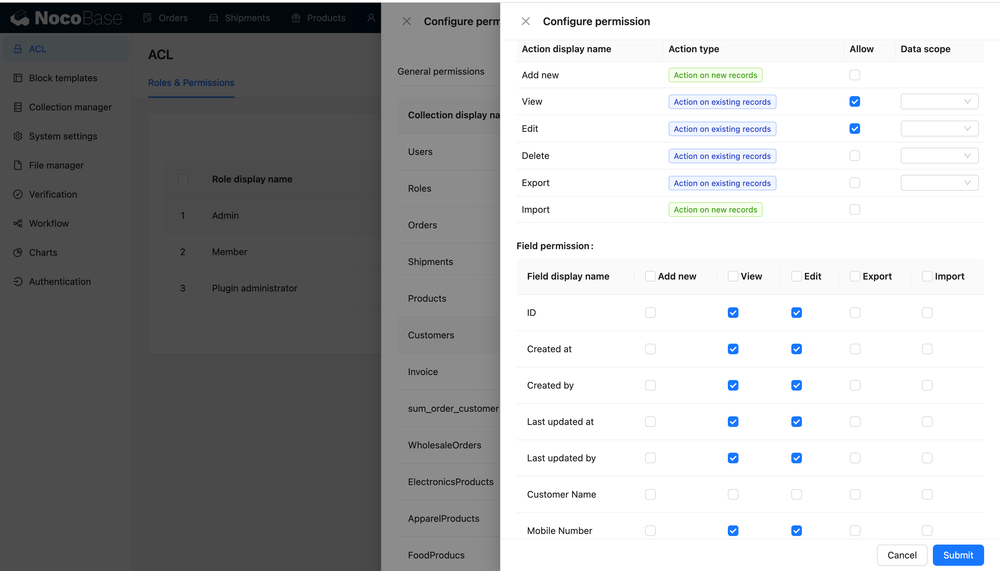

完整示例配置流程如下

关系字段组件为子表格时情况和子表单一致：

如图订单表中有关系字段「运单」，订单中的关系字段「运单」有所有权限，而运单表设置单独权限为只读

在 UI 中表现为：该关系字段可见，而当切换为子表格时（子表格内的字段在查看操作中可见，在新建和编辑操作中不可见）

进一步控制子表格内字段权限：个别字段拥有权限

#### 作为区块时

- 关系区块的由对应关系字段目标表权限控制，和关系字段权限无关

如图「客户」关系区块是否显示由客户表权限控制

- 关系区块内的字段由目标表中的字段权限控制

如图为客户表设置个别字段拥有查看权限

