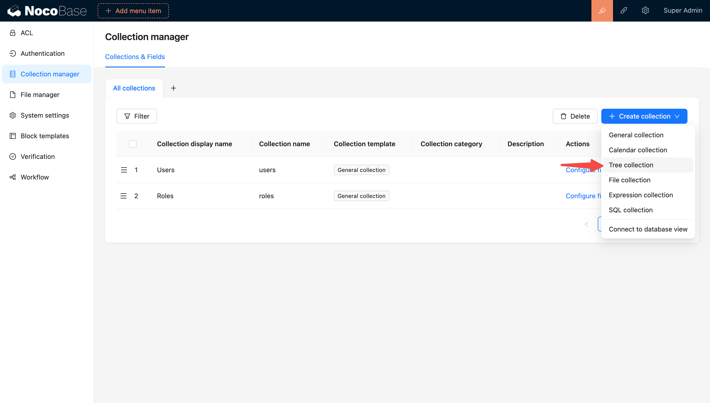
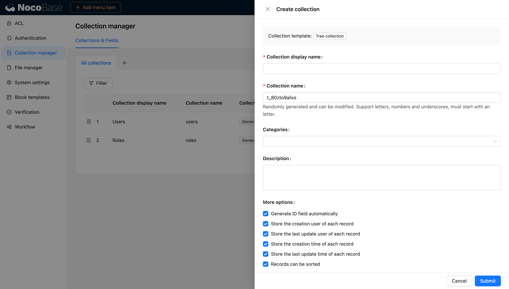

# 树表



和普通表一样支持自定义设置数据表的行为



树表模板中的预定义字段

```go
[
      {
        interface: 'integer',
        name: 'parentId',
        type: 'bigInt',
        isForeignKey: true,
      },
      {
        interface: 'm2o',
        type: 'belongsTo',
        name: 'parent',
        foreignKey: 'parentId',
        treeParent: true,
        onDelete: 'CASCADE',
      },
      {
        interface: 'o2m',
        type: 'hasMany',
        name: 'children',
        foreignKey: 'parentId',
        treeChildren: true,
        onDelete: 'CASCADE',
      },
    ]
```

树表创建时的初始化字段


树表数据表模板是通过自关联字段实现树形结构的设计

- 父节点关联字段（Many to One）：通常称为 "Parent" 字段，它与同一表中的其他记录建立关联，表示每个节点的父节点。
- 子节点关联字段（One to Many）：通常称为 "Children" 字段，它表示每个节点可以有多个子节点
