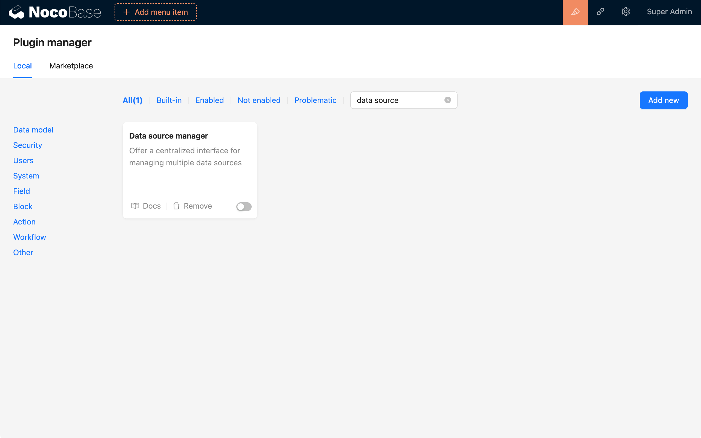

# 数据源管理

## 介绍

数据源管理插件提供中心化的多数据源管理界面，可以管理每个数据源的数据表和权限。数据源管理插件只是提供所有数据源的管理界面，并不提供接入数据源的能力，需要和适配的各种数据源插件搭配使用，目前支持接入的数据源包括：

- [数据源 - PostgreSQL（@nocobase/plugin-data-source-postgres）](/plugins/data-source-postgres)
- [数据源 - MySQL 插件（@nocobase/plugin-data-source-mysql）](/plugins/data-source-mysql)
- [数据源 - MariaDB 插件（@nocobase/plugin-data-source-mariadb）](/plugins/data-source-mariadb)

除此之外，也可以扩展，可以是常见的各类数据库，也可以是提供 API（SDK）的平台。

:::info{title="连接数据源 和 连接外部数据 区别"}
- **连接数据源** 指的是与特定数据库或 API 服务建立连接，可以完整的使用数据库的特性或 API 提供的服务；
- **连接外部数据** 指的是从外部获取数据并映射到本地使用，在数据库里叫 FDW（Foreign Data Wrapper），是一种数据库技术，侧重于将远程表当做本地表使用，只能一张一张表的连接。因为是远程访问，所以在使用时会有各种约束和局限。

二者之间联系：前者用于建立与数据源的连接，后者用于跨数据源访问。例如，连接了某个 PostgreSQL 数据源，这个数据源里有某个表是基于 FDW 创建的外部数据表。
:::

## 安装

## 使用手册

